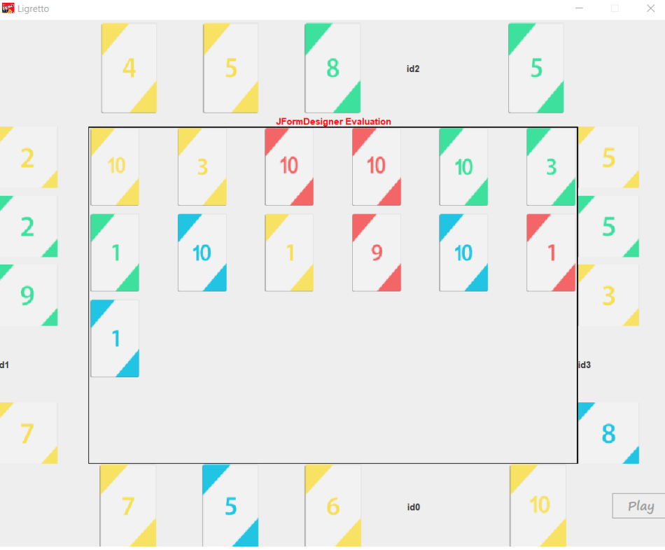
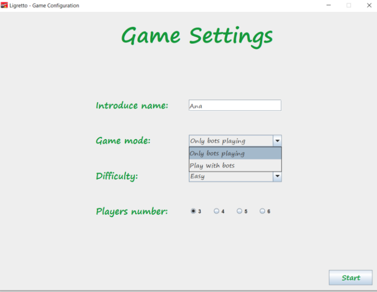

# Ligretto

* Tech Stack: Java + Java Swing
* Desktop application simulating a Ligretto game (card game), aiming to outline concurrency problems that might appear.
 

* Allows users to play against bots; a game is configurable.
 

